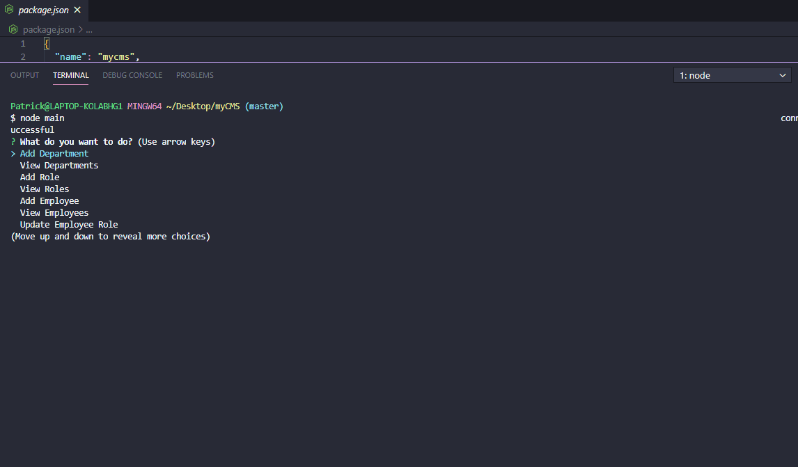

# MyCMS

## Description

This CLI uses inquirer and a MySQL connection to allow the user to interact with a database of employees.

## Table of contents

- [Installation](#Installation)
- [Tests](#Tests)
- [Technologies](#Built-with)
- [License](#License)
- [Questions](#Questions)

### Installation

    The Application should be installed by running the following commands:

Run 'npm i' to install all dependencies and run 'node' to initialize the CLI app. It may help to have your terminal in fullscreen

## Demonstration

## Tests

This app does not include jest tests

## Built With

Javascript, Inquirer, MySQL

## License

MIT

## Questions

- **Patrick Bridwell** - _Lead Developer_
  If you have any questions about the application, feel free to contact me.

* [patbridwell@cox.net](Email)
  

* [My Github Repository](https://api.github.com/users/PBridwell/repos)
* [My personal Portfolio](https://pbridwell.github.io/)
